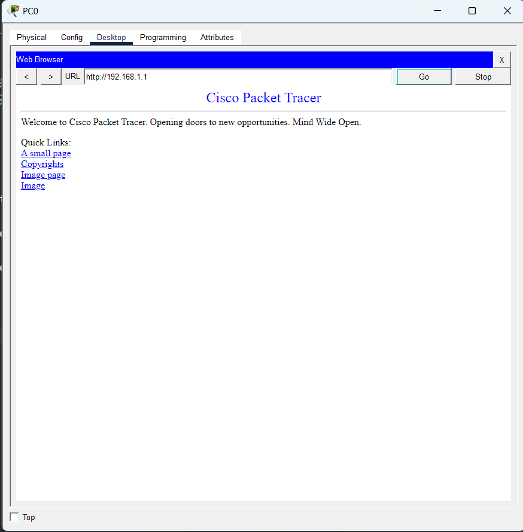
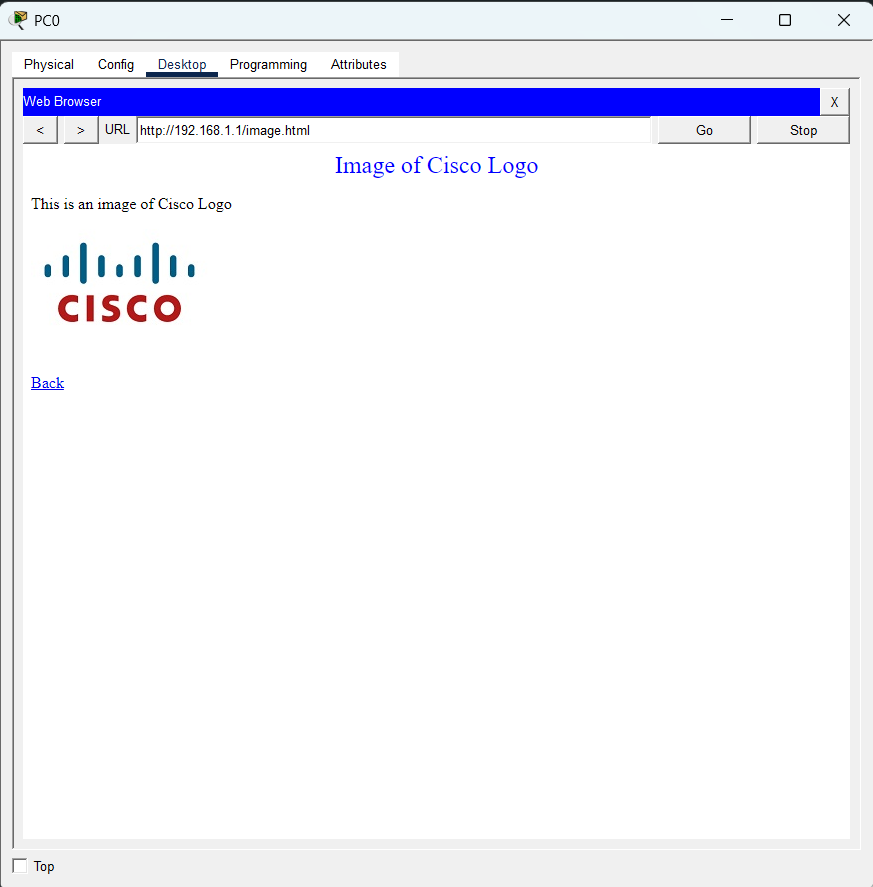
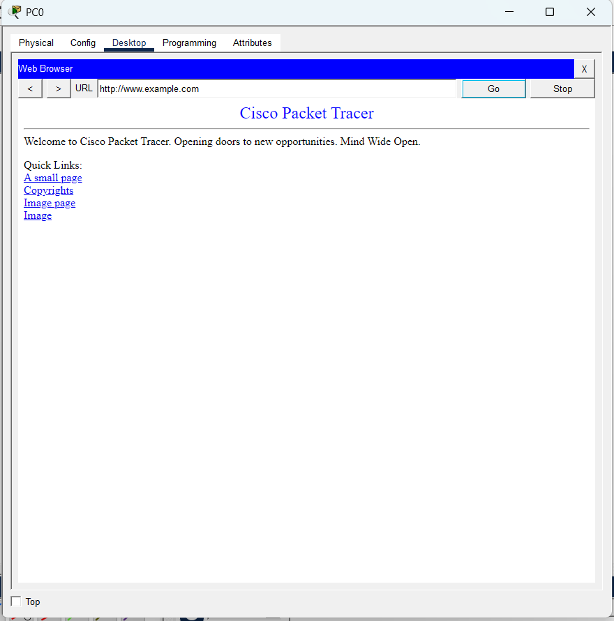
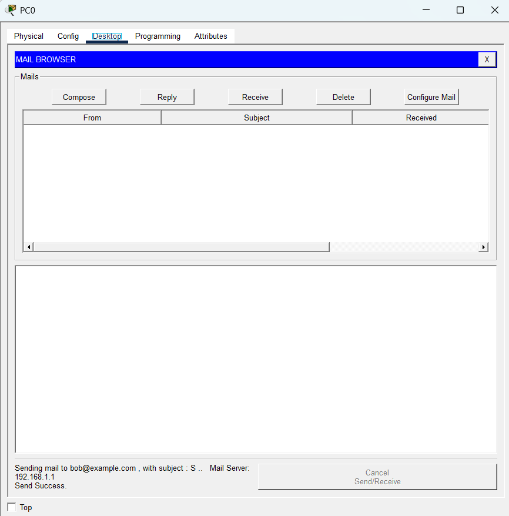
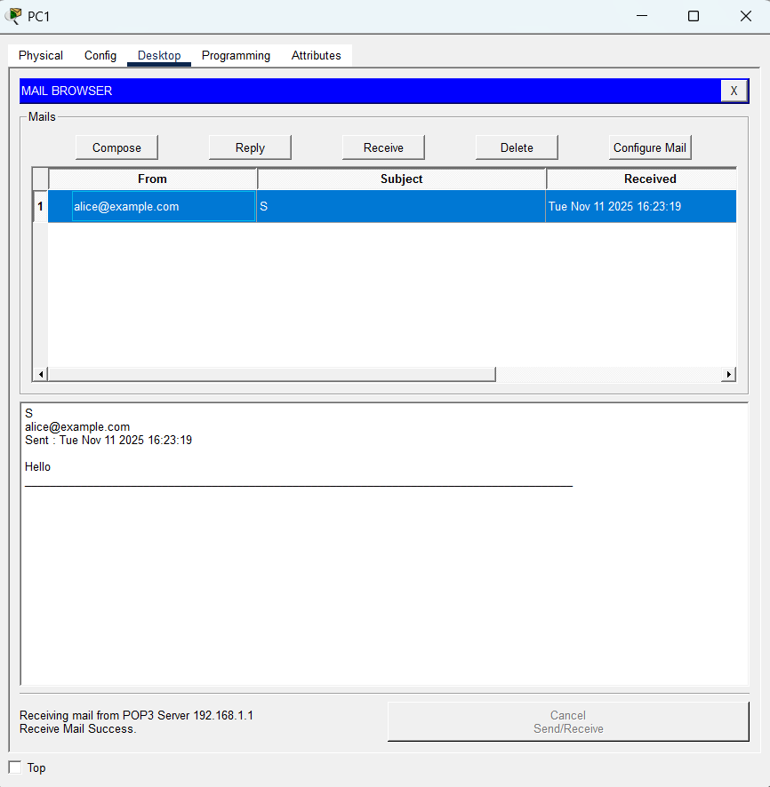
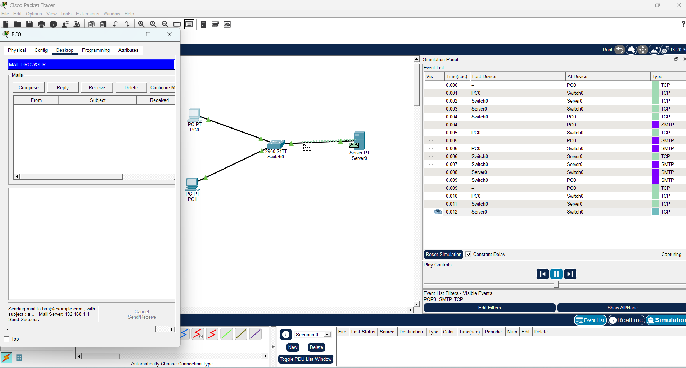
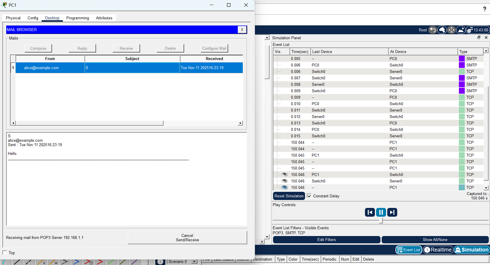

  
Name: Virak Rith

Student ID: P20230033

Course: Networks System Design

Instructor: KUY Movsun

Assignment: Lab3

Due Date: November 18, 2025 (12:00 AM)

 

## Part A – HTTP Requests and Responses

1. On the Server → Services → HTTP, switch HTTP = On.
2. Notice the default file list already contains index.html and image files (e.g., logo.gif, background.png). These built-in files already include embedded objects.
3. On PC1 → Desktop → Web Browser, enter http://192.168.1.1.
4. You should see the default Cisco Packet Tracer Server page with text and images. Open it.
5. Switch to Simulation Mode. Filter protocols to show HTTP and TCP.
6. Click Go/Refresh in the browser and watch multiple HTTP GET requests (for the HTML page and each embedded image or CSS file).
   
   

### 1. How many HTTP requests were sent?

Based on the simulation event list, **at least one HTTP request** was sent. This is visible in the "Type" column where an event is labeled **HTTP**, indicating that a web request was made from a PC to the server.

### 2. What transport protocol does HTTP use?

HTTP uses the **TCP (Transmission Control Protocol)**. This is confirmed by the multiple TCP events before and after the HTTP event in the simulation, showing that a TCP connection was established to carry the HTTP request and response reliably.

### 3. Why does one web page request result in multiple HTTP requests?

A single web page often includes **multiple embedded resources** such as images, stylesheets, and scripts. Each of these requires a **separate HTTP GET request**. Therefore, loading one page can trigger several HTTP requests—one for the main HTML file and additional ones for each embedded object. In this simulation, only one HTTP request was visible, likely for the main page. More requests would appear if the page contained additional embedded content.

## Part B – HTTP GET and Response Details

## DNS and HTTP Communication Sequence

1. On the Server → Services → DNS → switch DNS = On.
2. Add an A record: Host: www.example.com → Address: 192.168.1.1.
3. On PC1 and PC2 → Desktop → IP Configuration → 4. set DNS Server = 192.168.1.1.
4. On PC1 browser, visit http://www.example.com .
5. Switch to Simulation Mode and enable filters for DNS, HTTP, and TCP.

6. Observed Sequence:

   1. **DNS Query → Server**  
      PC1 sends a DNS request to resolve a domain name (e.g., `www.example.com`) into an IP address.

   2. **DNS Response with IP Address**  
      The DNS server replies with the corresponding IP address of the web server (Server0).

   3. **HTTP GET to That IP**  
      Using the resolved IP address, PC1 initiates an HTTP GET request to retrieve the web page from Server0.

### Explanation:

This sequence shows how DNS acts as a prerequisite for HTTP communication. Without DNS resolving the domain name, the PC wouldn't know the IP address to send the HTTP request to. Once the IP is known, the browser can establish a TCP connection and request the desired content using HTTP.

### Questions

### What happens if the DNS Server address on the PC is wrong?

If the DNS server address is incorrect, the PC will **fail to resolve domain names** (like `www.example.com`) into IP addresses. As a result, the browser **won’t know where to send the HTTP request**, and the web page will not load. You may see a "Server not found" or "DNS error" message.

### Why is DNS important before HTTP communication?

DNS is essential because it **translates human-readable domain names** (e.g., `www.google.com`) into **IP addresses** that computers use to route data. Without DNS, the PC cannot locate the web server’s IP address, so **HTTP communication cannot begin**.

## Part C – Email Transfer using SMTP and POP3

### Send and Receive

### Send and Receive with simulation

### Which protocol sent the email to the server?

The protocol used to **send** the email from Alice (PC1) to the server is **SMTP (Simple Mail Transfer Protocol)**.

### Which protocol retrieved the email from the server?

The protocol used to **retrieve** the email by Bob (PC2) from the server is **POP3 (Post Office Protocol version 3)**.

### Why does email use two different protocols instead of one?

Email uses two different protocols because they serve **separate purposes**:

- **SMTP** is designed for **sending** messages from a client to a mail server or between servers.
- **POP3** is designed for **retrieving** messages from a mail server to a client.

This separation allows email systems to handle sending and receiving independently, ensuring better reliability and flexibility in how messages are delivered and accessed.
