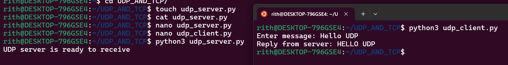
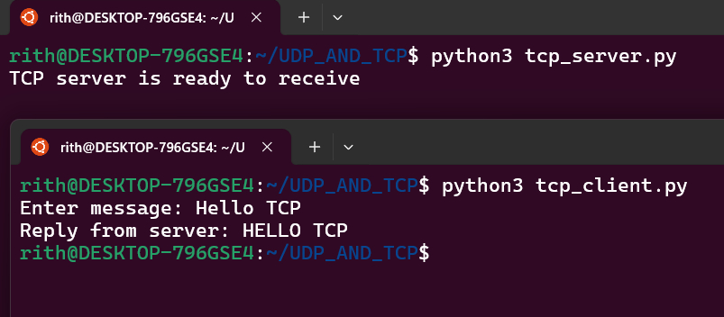
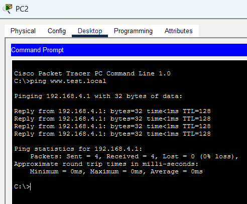
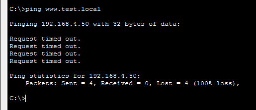

  
Name: Virak Rith

Student ID: P20230033

Course: Networks System Design

Instructor: KUY Movsun

Assignment: Lab4

Due Date: November 04, 2025 (12:00 AM)

 

# Activity 1 – Video Streaming and Server Load

**Q1: What happens to traffic on the link between the server and switch when all three PCs request the file?**

- All three PCs send simultaneous HTTP requests to the server.
- The server must deliver a full copy of `video.bin` to each client.
- This causes heavy traffic on the single server–switch link.
- Result: congestion and increased delay as multiple streams compete for bandwidth.

**Q2: How would the situation change if the file were copied to another server closer to one of the PCs (CDN idea)?**

- The nearby PC can fetch the file locally, reducing load on the original server link.
- Traffic is distributed across multiple servers instead of one central point.
- This lowers congestion and improves response times.
- This mirrors how CDNs replicate content to balance load and reduce latency.

**Q3: Why do real streaming services use buffering and multiple distributed servers?**

- Buffering allows clients to pre‑download video segments, ensuring smooth playback despite network delays.
- Distributed servers (CDNs) let users connect to nearby servers, reducing latency and avoiding bottlenecks.
- Together, these techniques improve scalability, reliability, and user experience.
- They enable millions of users to stream simultaneously without overwhelming a single server.

# Activity 2 – Peer-to-Peer Style Sharing via FTP

## 1. Download fileA.txt from Server1

## 2. Download fileB.txt from Server2

## 3. Upload fileA.txt to Server2:

## 4. Upload fileB.txt to Server1

## Result & Discussion

- After completing the activity, both **Server1** and **Server2** host `fileA.txt` and `fileB.txt`.
- This demonstrates how files can be replicated across multiple peers rather than being stored on a single central server.
- Each peer acts as both a **client** (downloading files) and a **server** (uploading files), which is the essence of peer-to-peer (P2P) systems.
- The result shows that content availability increases, load is distributed among peers, and reliance on one central server is reduced.
- In practice, this improves **fault tolerance** and **scalability**, since files remain accessible even if one peer goes offline.

---

## Questions & Answers

**1. How is this different from a single central server hosting all files?**

- In a central server model, all clients depend on one server for access.
- In P2P, files are distributed among peers, so multiple sources can provide the same file.
- This reduces bottlenecks and avoids overloading one server.

**2. In a real P2P system, how would new peers discover which peers have each file?**

- Real P2P systems use **peer discovery mechanisms** such as:
  - **Trackers** (e.g., in BitTorrent) that maintain lists of peers with specific files.
  - **Distributed Hash Tables (DHTs)** that map file identifiers to peers.
  - **Broadcast or query messages** within the network to locate peers holding the file.

**3. Why can P2P systems scale better than pure client–server systems for large distributions?**

- Because the more peers join, the more resources (bandwidth, storage) are available.
- Each new peer not only consumes but also contributes, so capacity grows with demand.
- This makes P2P highly scalable for distributing large files (e.g., software updates, media).

---

# Activity 3 – UDP and TCP Socket Programming (Python)

## UDP Example

## UDP Questions

### 1. Is there any connection setup (handshake) before sending messages?

- UDP does **not** use a handshake.
- Unlike TCP, which requires a three-way handshake to establish a reliable connection, UDP is connectionless.
- This means a client can send data immediately without waiting for setup.

---

### 2. What could happen if packets are lost?

- Since UDP does not guarantee delivery, **lost packets are simply gone**.
- There is no retransmission or acknowledgment mechanism built into UDP.
- If a packet is dropped, the receiving side won’t know unless extra logic is added.

---

### 3. Does the code detect or recover from it?

- By default, **UDP code does not detect or recover from packet loss**.
- If reliability is needed, developers must implement their own error-checking, acknowledgments, or retransmission logic at the application level.
- In simple UDP socket programs, the code just sends and receives messages without recovery.

---

### 4. Why might UDP be useful for real-time applications such as voice or video?

- **Speed and low latency:** UDP avoids the overhead of connection setup and retransmission.
- **Tolerance for loss:** Real-time applications (like voice or video streaming) can tolerate occasional packet loss better than delays caused by retransmission.
- **Continuous flow:** Even if some packets are lost, the stream continues smoothly, which is more important for user experience than perfect accuracy.
- That’s why streaming services, VoIP, and online gaming often rely on UDP.

---

## TCP Example

## TCP vs UDP Questions

### 1. What extra step does TCP perform before sending data that UDP does not?

- TCP requires a **connection setup (three-way handshake)** before data transfer begins.
- This handshake establishes a reliable connection between client and server, ensuring both sides are ready.
- UDP does not perform this step — it is connectionless, so packets are sent immediately without prior setup.

---

### 2. Which transport protocol (UDP or TCP) is more appropriate for file transfer? Why?

- **TCP is more appropriate for file transfer.**
- TCP guarantees reliable delivery through acknowledgments, retransmissions, and ordered packet delivery.
- File transfer requires accuracy — missing or corrupted packets would break the file.
- UDP does not guarantee delivery or order, so it is unsuitable for tasks where every byte matters.
- That’s why protocols like FTP, HTTP, and SMTP are built on TCP.

---

### 3. How could you modify these examples to send multiple messages over one TCP connection?

- In TCP, once the connection is established, you can send multiple messages without reconnecting.
- To modify the examples:
  - Keep the **socket open** after the first message.
  - Use a **loop** on both client and server sides to continuously send and receive data until one side closes the connection.
  - For example, in the client code, wrap `send()` calls inside a loop that reads user input repeatedly.
  - On the server side, keep reading from the socket until the client disconnects.
- This way, one TCP connection can handle multiple messages, reducing overhead compared to reconnecting for each message.

---

# Activity 4 – DNS TTL and Cache Behavior

## 

---

---

## Questions

**Q1: Why did PC1 use the old IP address after the DNS record was changed?**

- PC1 had cached the DNS response from the server.
- When the DNS record was updated, PC1 continued using the cached entry until the cache expired or was cleared.
- This explains why it still resolved to the old IP address.

**Q2: What problems can occur if a popular website changes its IP address but many clients still have old records cached?**

- Clients may fail to connect, leading to downtime or errors.
- Users may experience inconsistent service if some reach the new IP while others use the old one.
- Load balancing may break, causing uneven traffic distribution.
- Potential security risks if the old IP is reassigned to another host.

**Q3: Why might CDNs and large websites use low DNS TTL values?**

- Allows rapid updates when redirecting users to different servers.
- Ensures quick failover if a server goes down.
- Helps balance traffic across multiple distributed servers.
- Provides flexibility to adapt to changing network conditions.

**Q4: How does caching help reduce DNS traffic overall?**

- Reduces the number of queries sent to DNS servers.
- Improves performance by resolving names faster from local cache.
- Lowers network load and prevents DNS infrastructure from being overwhelmed.
- Provides stability and efficiency for large-scale Internet usage.
