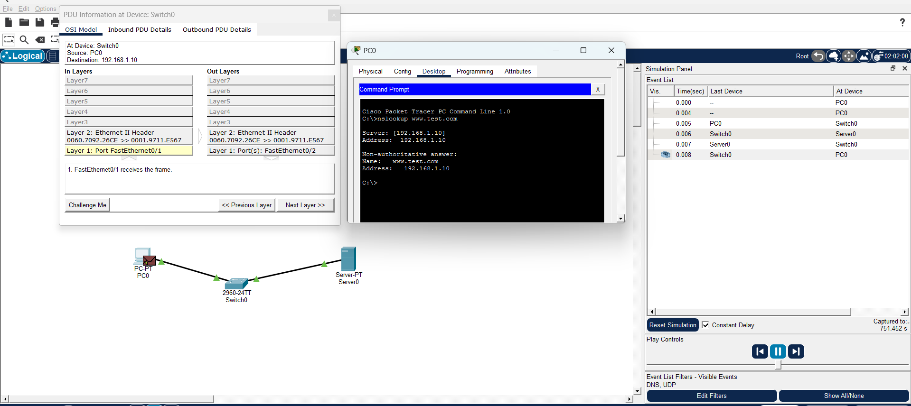
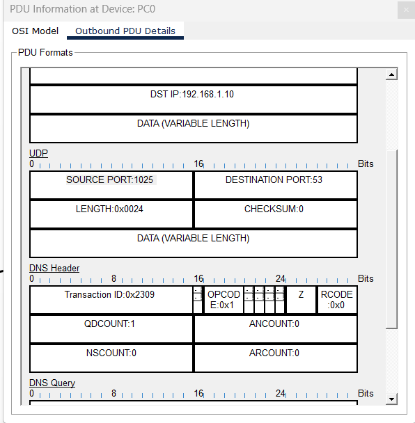
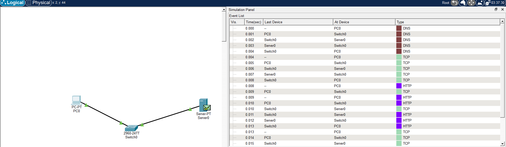
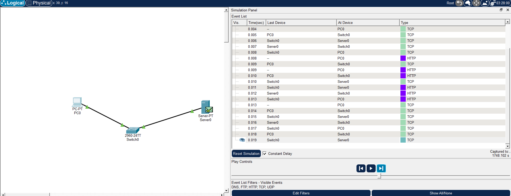
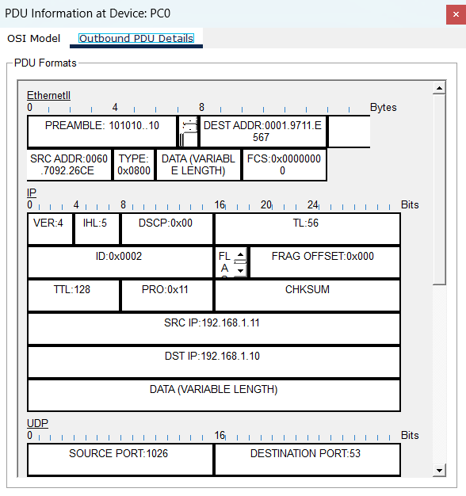
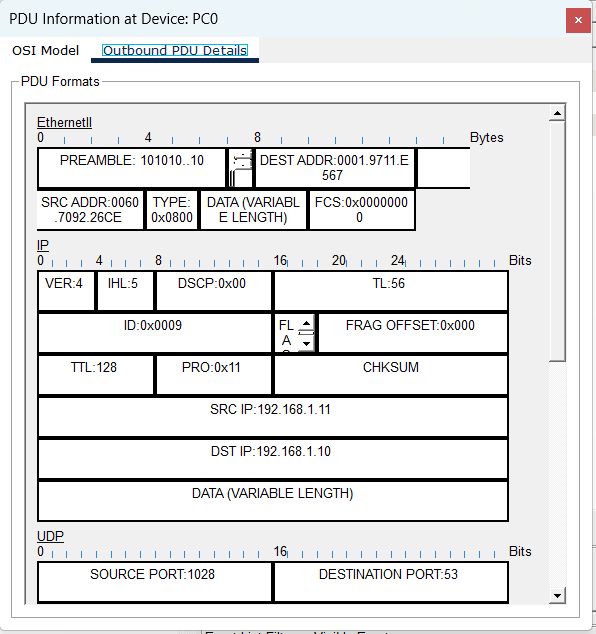
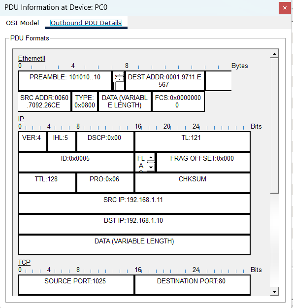
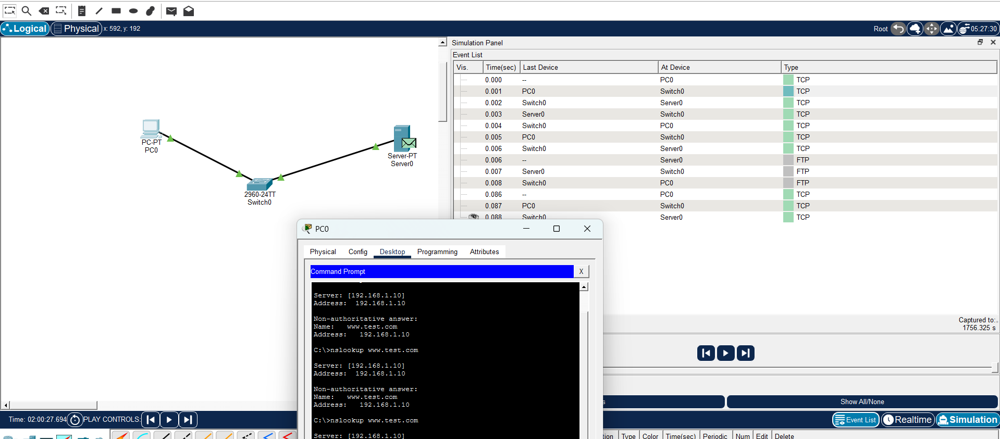

<p>
  
Name: Virak Rith

Student ID: P20230033

Course: Networks System Design

Instructor: KUY Movsun

Assignment: Lab5

Due Date: December 02, 2025 (12:00 AM)

</p>
<br/>

# Part 1: Lab Topology Setup



# Part2 Visualizing UDP

## Analysis: Outbound PDU Details – UDP Section

- **Source Port**: 1027 — dynamically assigned by PC1 for the DNS query.
- **Destination Port**: 53 — standard port for DNS service.
- **Source IP**: 192.168.1.1 — IP address of PC1.
- **Destination IP**: 192.168.1.10 — IP address of the DNS server.
- **Protocol Used**: UDP — connectionless transport protocol suitable for DNS.
- **Application Layer Protocol**: DNS — initiates the query.
- **MAC Addresses**: PC1 (00E0.F999.2C9C) → Server (000A.F373.E8A8) via Ethernet.

This confirms that the DNS query is correctly encapsulated and routed using UDP to the DNS server.

### Lab Report Answers (Part 2 – UDP Analysis)

**Q1: How many bytes is the UDP header?**  
The UDP header is 8 bytes long, consisting of four 2-byte fields: Source Port, Destination Port, Length, and Checksum.

**Q2: What is the Destination Port number? Why this specific number?**  
The Destination Port is 53, which is the standard port used by DNS servers to receive queries.

**Q3: Do you see "Sequence Number" or "Acknowledgment" fields? Why or why not?**  
No, because UDP is a connectionless protocol and does not use sequence or acknowledgment fields. These are features of TCP, which provides reliable delivery.

### Part 3: UDP Checksum Calculation



**Extracted 16-bit words:**

- Source Port: 1025 → 0x0401
- Destination Port: 53 → 0x0035
- Length: 0x0024
- Checksum (initial): 0x0000

**Step-by-step calculation:**

- Sum = 0x0401 + 0x0035 + 0x0024 = 0x045A
- Checksum = ~0x045A = 0xFBA5

**Receiver validation:**

- 0x0401 + 0x0035 + 0x0024 + 0xFBA5 = 0xFFFF → Packet is valid

**Error simulation:**

- Flip one bit in Length (e.g., 0x0025)
- New sum ≠ 0xFFFF → Error detected

### Part 3: UDP Checksum Calculation (Binary Method)

## **UDP Header Fields (16-bit words):**

**Step 1: The Sender (You)**

```
 0110011001100110
+0101010101010101
=1011101110111011
```

**Checksum: Flip every bit of your Sum (1s complement).**

```
Checksum = 0100010001000100
```

**Step 2: The Error**

```
Error! Corrupted Word 2: 0101010101010100
```

**Step 3: The Receiver**

Rule: If result is all 1s, data is valid. If any 0 exists, drop packet.
• Sum between Word 1 and Corrupted Word 2

```
 0110011001100110
+0101010101010100
=1011101110111010
```

Sum with Checksum

```
 1011101110111010
+0100010001000100
=1111111111111110
```

📝 Lab Report Questions

- **Q4:** Did your final calculation result in all 1s? No. Your final sum after adding the corrupted word and checksum is 1111111111111110, which is not all 1s (0xFFFF). This means the checksum verification failed.

- **Q5:** Based on your result, would the receiver accept or drop this packet? The receiver would drop the packet because the final checksum verification result is not all 1s, indicating an error was detected.

# Part 4: The Multiplexing Mixer








## Lab Report Questions Explanation
- **Q1:** (The House Address): What is the Destination IP Address for both packets? Is it the same? The Destination IP Address is the unique numerical label assigned to the receiving device on the network. It acts like the "home address" for the packet, directing routers and switches where to send the data. For both packets, the Destination IP Address is found in the IP header and should be the same if they are intended for the same recipient. If the packets are part of the same communication session, their destination IP addresses will match.

- **Q2:** (The Room Number): Look at the Destination Port for HTTP vs DNS. What are they? The Destination Port identifies the specific service or application on the destination device. For HTTP traffic, the destination port is typically 80, which is the well-known port for web traffic. For DNS queries, the destination port is usually 53, used by DNS servers to receive requests. These ports tell the receiving device which application should handle the incoming packet.

- **Q3:** Look at the Source Port for the HTTP packet. Is it 80? Explain why it is a random high number. No, the source port for the HTTP packet is not 80. The source port is usually a random high-numbered port (above 1023) chosen by the client’s operating system. This ephemeral port is used to uniquely identify the client’s session and allow multiple simultaneous connections. The destination port is 80 (the server’s listening port), but the source port is random to avoid conflicts and enable proper routing of responses back to the correct client process.
