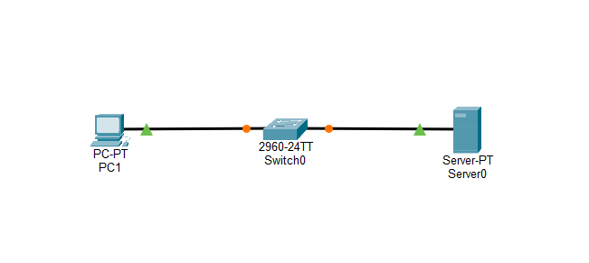
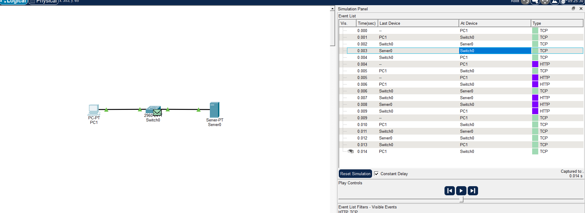
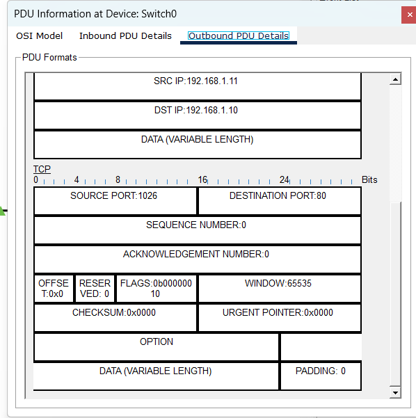
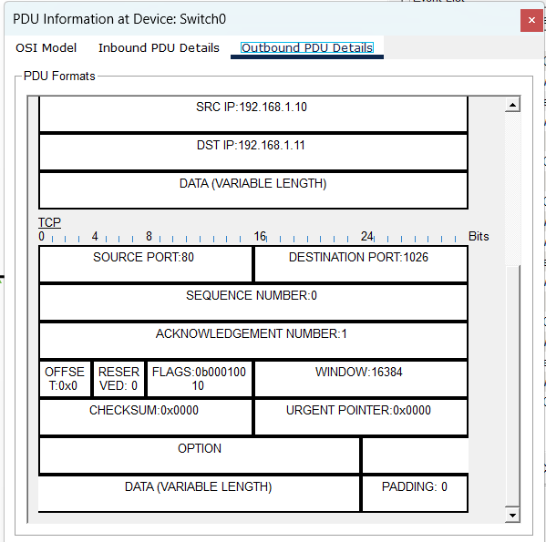
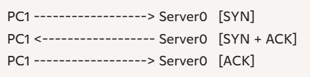
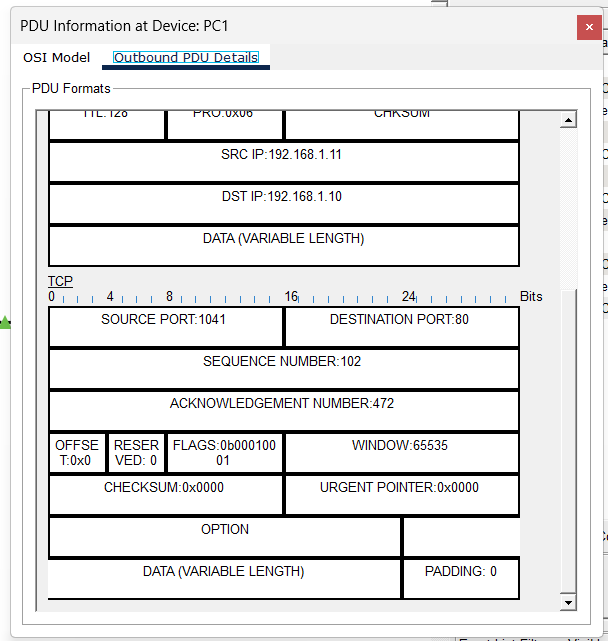

  
Name: Virak Rith

Student ID: P20230033

Course: Networks System Design

Instructor: KUY Movsun

Assignment: Lab5

Due Date: December 09, 2025 (12:00 AM)

 

# Part 1: Lab Setup

# Part 2: TCP 3-Way Handshake

| Step | Source  | Destination | TCP Flags       | Description                          |
| ---- | ------- | ----------- | --------------- | ------------------------------------ |
| 1    | PC1     | Server0     | SYN (0010)      | Client initiates connection          |
| 2    | Server0 | PC1         | SYN, ACK(10010) | Server acknowledges and responds     |
| 3    | PC1     | Server0     | ACK (10000)     | Client confirms, connection is ready |

### Simulation Table Highlights

- **Time 0.000–0.008 sec** shows TCP packets flowing through Switch0.
- Final entry shows **HTTP** packet at PC1, confirming handshake completion.

### Diagram

### Analysis

- The TCP 3-Way Handshake ensures **reliable connection setup** before data transfer.
- After the handshake, HTTP communication begins (as shown in your last row).

# Part 3: Sequence Number Detective

### Task

- Continue simulation after the TCP handshake.
- Capture the **HTTP response** packet from Server0 to PC1.
- Inspect the **TCP Header** for:
  - **Sequence Number (Seq)**
  - **Data Length (Len)**

### Steps

1. Click **Capture/Forward** until the HTTP packet appears from Server0 → PC1.
2. Open the packet details and record:
   - **Sequence Number (Seq):** `1`
   - **Data Length (Len):** `[fill in actual value from simulation]`
3. Predict the **Acknowledgement Number**:
   - Formula:

\[
\text{Expected ACK} = \text{Seq} + \text{Len}
\]

4. Forward the next packet (PC1 → Server0).
5. Confirm the **Acknowledgement Number** matches your prediction.

### Example Table

| Field                    | Value (example) | Notes                                    |
| ------------------------ | --------------- | ---------------------------------------- |
| Sequence Number (Seq)    | 1               | Starting byte of HTTP response           |
| Data Length (Len)        | 471             | Payload size in bytes                    |
| Expected ACK             | 472             | Seq + Len                                |
| Actual ACK (PC → Server) | 472             | Matches prediction → connection in order |

### Analysis

- TCP uses **sequence numbers** to track byte order and ensure reliable delivery.
- The client acknowledges the **last byte received + 1**.
- This confirms successful receipt and readiness for the next segment.

# Part 4: Breaking the Network (TCP Retransmission)

### Task

- Observe how TCP handles packet loss by forcing a failure in the network.

### Steps

1. **Reset Simulation** completely.
2. Set filters to allow **TCP** packets.
3. On PC1, open the browser and request the website again (Server0).
4. Wait until the **3-Way Handshake** is complete.
5. Before the HTTP packet returns, use the **Delete Tool (X)** to cut the cable between **Server0** and **Switch0**.
6. Continue clicking **Capture/Forward** to observe events.

### Observations

- PC1 waits for the HTTP response but does not receive it.
- After a timeout, TCP automatically **retransmits** the packet.
- This shows TCP’s reliability mechanism: it detects loss and resends data.

### Analysis

- **TCP Retransmission** ensures reliable delivery by resending lost packets.
- If this were **UDP** (e.g., live video stream):
  - The packet would **not** be resent.
  - UDP is connectionless and does not guarantee delivery.
  - Lost packets simply result in missing frames or data.

### Key Takeaway

- TCP sacrifices speed for reliability (resends lost data).
- UDP sacrifices reliability for speed (no retransmission).

# Part 5: The Pipeline Race

### Scenario

- Link speed: **1 Gbps**
- Packet Transmission Time: **0.008 ms**
- Round Trip Time (RTT): **30 ms**
- Formula for Utilization:

U = (N × Transmission Time) / (RTT + Transmission Time)

### Questions & Calculations

**Q2 (Stop-and-Wait, N=1):**

U = (1 × 0.008) / (30 + 0.008) ≈ 0.000266 (or 0.0266%)

**Q3 (Pipelining, N=3):**

U = (3 × 0.008) / (30 + 0.008) ≈ 0.000799 (or 0.0799%)

**Q4 (Improvement Factor):**

Factor = U(N=3) / U(N=1) = 0.000799 / 0.000266 ≈ 3.0

### 📊 Results Table

| Scenario           | N   | Utilization (U) | Percentage     |
| ------------------ | --- | --------------- | -------------- |
| Stop-and-Wait      | 1   | 0.000266        | 0.0266%        |
| Pipelining         | 3   | 0.000799        | 0.0799%        |
| Improvement Factor | -   | ~3×             | 3 times better |

### Analysis

- **Stop-and-Wait** wastes most of the link capacity because the sender waits for each ACK before sending the next packet.
- **Pipelining** allows multiple packets to be in flight, increasing utilization.
- Even with just 3 packets, utilization improves by a factor of ~3.

# Part 6: Flow Control & Teardown

### Task

- Observe how TCP manages buffer space (Flow Control) and how connections are closed (Teardown).

### Steps

1. Reconnect the cables between **Server0** and **Switch0**.
2. Load the website successfully from **PC1**.
3. Capture the **last packet** received by PC1.
4. Inspect the **TCP Header** → look for the **Window Size** field.
   - This value tells the Server how many bytes the PC can still accept.
5. Close the browser on PC1.
6. Observe the **FIN packets** exchanged during connection termination.

### Observations

- **Window Size field:** Indicates available buffer space at the receiver.  
  Example: If Window Size = 4096, it means “My buffer can accept 4096 more bytes.”
- **Connection Teardown:** TCP uses a **4-step FIN handshake**:
  1. PC1 → Server0: FIN
  2. Server0 → PC1: ACK
  3. Server0 → PC1: FIN
  4. PC1 → Server0: ACK

### Diagram

### Analysis

- **Flow Control:** Prevents buffer overflow by telling the sender how much data can be sent.
- **Teardown:** Ensures both sides gracefully close the connection, avoiding data loss.
- TCP’s teardown is reliable and orderly compared to UDP, which has no formal closing process.
