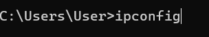
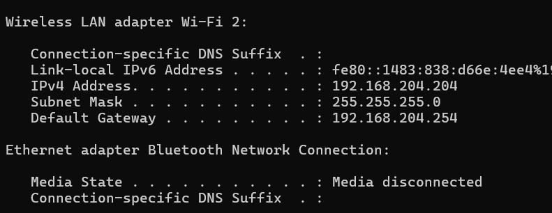
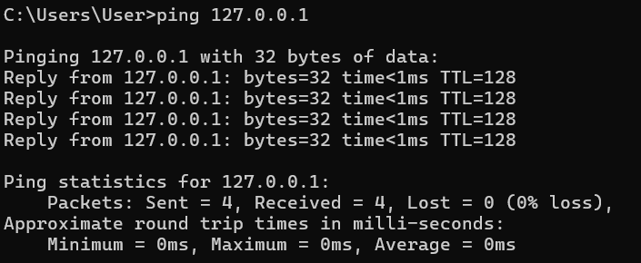
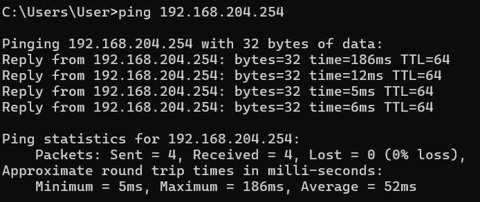
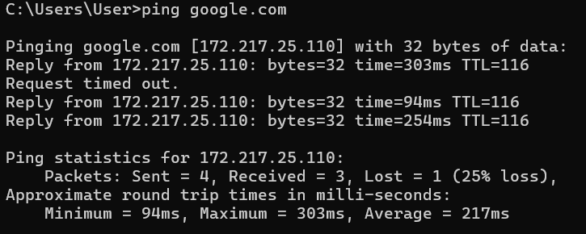
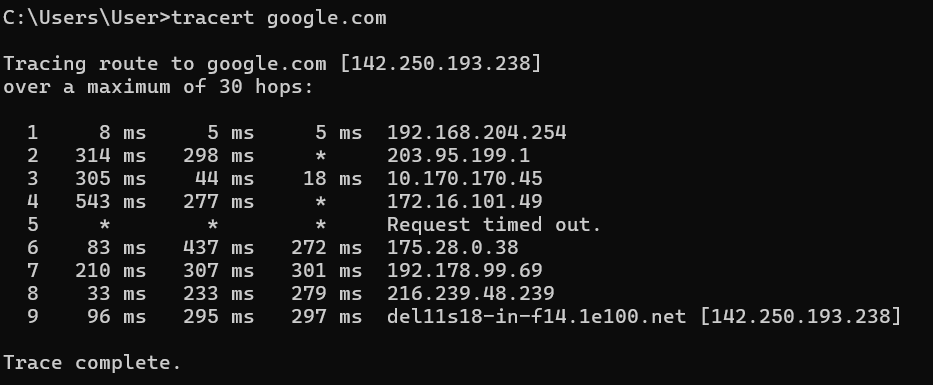
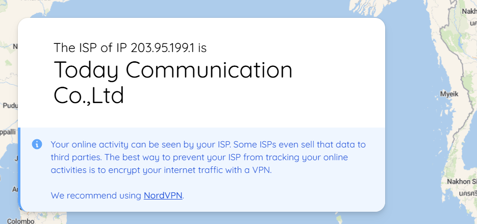
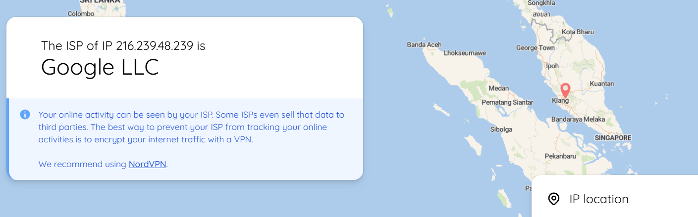

<p>
  
Name: Virak Rith

Student ID: P20230033

Course: Networks System Design

Instructor: KUY Movsun

Assignment: Lab1

Due Date: October 28, 2025 (12:00 AM)

</p>
<br/>

## Part 1: Identifying Your Host and Edge Connection

### Open the Command Line/Terminal




```
My Host IP Address: 192.168.204.204
My Default Gateway: 192.168.204.254
```

## Part 2: Testing Connectivity and Latency

1. ping 127.0.0.1



2. ping Default Gateway: 192.168.204.254



3. ping google.com



### Table

| Test Target     | Min RTT (ms) | Max RTT (ms) | Avg RTT (ms) | Packet Loss (%) |
| --------------- | ------------ | ------------ | ------------ | --------------- |
| 127.0.0.1       | 0            | 0            | 0            | 0%              |
| 192.168.204.254 | 5            | 186          | 52           | 0%              |
| google.com      | 94           | 303          | 217          | 25%             |

## Part 3: Tracing the Path Through the Network Core

Execute the Trace Command ( tracert google.com ) and Identify Core Components: List the IP address and RTT for **Hops 2, 5, and 8** (or the closest available public IPs).



Hop 2:

Hop6:

Hop8:


| Hop | IP Address     | RTT (ms) | ISP / Organization Name      |
| --- | -------------- | -------- | ---------------------------- |
| 2   | 203.95.199.1   | 298–314  | Today Communication Co., Ltd |
| 6   | 175.28.0.38    | 83–437   | Telcotech Ltd                |
| 8   | 216.239.48.239 | 33–279   | Google LLC                   |

## Part 4: Calculating Transmission Delay

### Given:

- Packet size \( L = 12,000 Kbits \)
- Transmission rate \( R = 100,000,000 bits/sec )
- Number of links = 5

### Calculations:

```
dtrans = L/R =12,000/100,000,000 = 0.00012sec = 0.12 ms
```

```
Total Delay = 5 \* 0.12 = 0.6 ms
```

### Submission Answer

**Store-and-Forward** means each router must receive the entire packet before forwarding it to the next link. This adds delay at every hop, so the total end-to-end delay is the transmission delay multiplied by the number of links.

## Link to GitHub Account : [Click Here](https://github.com/Poppykhim/I3S1_NetworksSystemDesign_Lab.git) <3

Note: Viewing in VsCode IDE for better formatting!!!
