

  
Name: Virak Rith

Student ID: P20230033

Course: Networks System Design

Instructor: KUY Movsun

Assignment: Lab2

Due Date: November 04, 2025 (12:00 AM)

 

# Activity 1 — Network Performance: Delay, Loss & Throughput

## Part A. Manual Calculation

Scenario:

    File size: 5 MB

    Link speed: 10 Mbps

    RTT: 50 ms

    Packet loss: 2%

    Packet size: 1500 bytes

1. Transmission Delay for One Packet

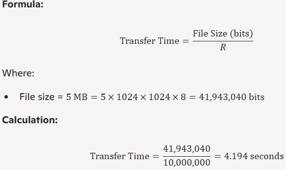

---

2.  Ideal Transfer Time for 5 MB File

  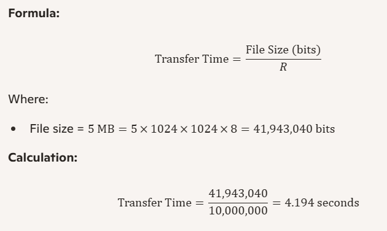

---

3. Compute the effective throughput with 2 % packet loss.

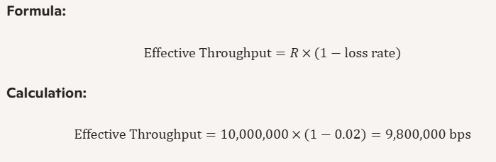

---

| Metric               | Value         |
| -------------------- | ------------- |
| Transmission Delay   | 1.2 ms        |
| Ideal Transfer Time  | ~4.19 seconds |
| Effective Throughput | 9.8 Mbps      |

## Part B. Packet Tracer Measurement

1. Create a simple topology: PC0 — Switch — PC1 with straight-through cables.

   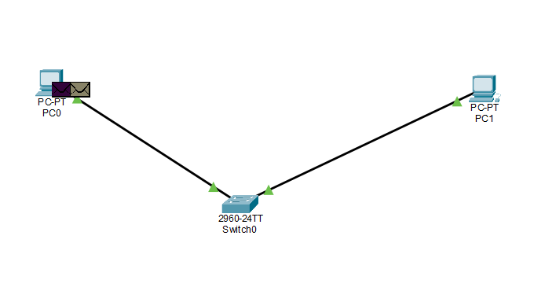

2. ign IPs: PC0 192.168.1.1/24, PC1 192.168.1.2/24.
   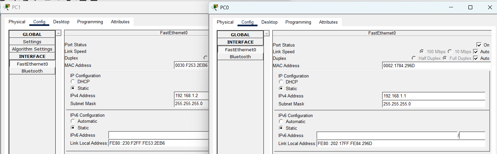
3. Test connectivity from PC0 using ping 192.168.1.2.
   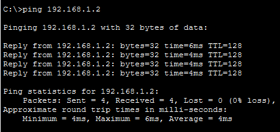
4. Switch to Simulation Mode → use the Simple PDU (envelope icon) from PC0 → PC1.
5. Open the Event List and record the time when the Echo Request leaves PC0 and when the Echo Reply returns to PC0 (this is your RTT).
6. Assume each Simple PDU ≈ 600 bits (typical ICMP ping).
   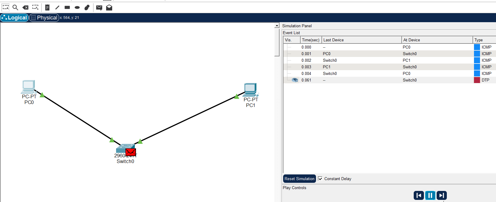
7. Calculate throughput using Throughput (bps) = Packet Size (bits) / RTT (seconds).
   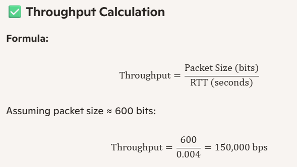

---

| Test | Packet Size (bits) | RTT (s) | Throughput (bps) | Loss (%) |
| ---- | ------------------ | ------- | ---------------- | -------- |
| 1    | 600                | 0.004   | 150,000          | 0        |
| 2    | 600                | 0.004   | 150,000          | 0        |

### Discussion Prompts

### 1. Which types of delay can you observe in Simulation Mode?

- **Transmission Delay**: Time to push bits onto the link (visible in packet timestamps).
- **Propagation Delay**: Time for bits to travel across the cable (minimal in short topologies).
- **Queueing Delay**: Not significant in simple setups, but can appear with multiple PDUs.
- **Processing Delay**: Time routers/switches take to inspect and forward packets.

---

### 2. How does sending multiple PDUs quickly affect queueing or packet loss?

- Increases **queueing delay** as packets wait in buffer.
- May cause **packet loss** if buffer overflows (especially in congested or low-capacity links).
- Simulation shows delayed Echo Replies or dropped packets when PDUs are sent rapidly.

---

### 3. How does link speed influence throughput?

- Higher link speed = **faster transmission** = **higher potential throughput**.
- Throughput is limited by actual RTT and packet loss.
- In ideal conditions, throughput approaches link speed; in congested networks, it drops.

# Activity 2 — Protocol Layers & Encapsulation

1. Use the same PC0 – Switch – PC1 topology in Simulation Mode.
2. Send a Simple PDU from PC0 → PC1.
3. In the Event List, click the packet → PDU Information.

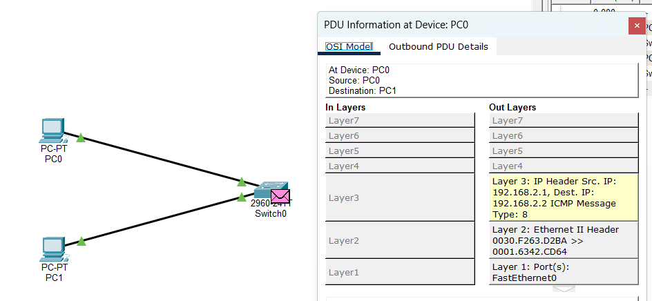

4. Review of Outbound and Inbound PDU Details

#### Outbound PDU (PC0 → PC1)

- **Layer 3 (Network)**: IP Header

  - Source IP: 192.168.2.1
  - Destination IP: 192.168.2.2
  - TTL is set here to control packet lifespan.

- **Layer 2 (Data Link)**: Ethernet II Header

  - Source MAC: 0030.F263.D2BA
  - Destination MAC: 0001.6342.CD64

- **Layer 1 (Physical)**:
  - Port: FastEthernet0

#### Inbound PDU (PC1 receives the packet)

- All headers are **removed** layer by layer:
  - **Layer 2**: Ethernet header is stripped to reveal IP packet.
  - **Layer 3**: IP header is removed to reveal ICMP message.
  - **Layer 4–7**: ICMP Echo Request is processed by the application.

5.  Identify visible layers and headers (Ethernet/MAC, IP, ICMP).

- **Data Link Layer (Ethernet/MAC)**

- Header: Ethernet II
- Source MAC: 0030.F263.D2BA
- Destination MAC: 0001.6342.CD64

- **Network Layer (IP)**

  - Header: IP
  - Source IP: 192.168.2.1
  - Destination IP: 192.168.2.2
  - TTL field is set here

- **Application Layer (ICMP)**
  - Header: ICMP
  - Type: 8 (Echo Request)

# Activity 3 — Security Visibility: Hub vs Switch

## Part A. Hub Network

1. Build 3 PCs (PC0, PC1, PC2) + 1 Hub.
2. Assign IPs: PC0 192.168.2.1, PC1 192.168.2.2, PC2 192.168.2.3
3. Switch to Simulation Mode → send Simple PDU from PC0 → PC1.

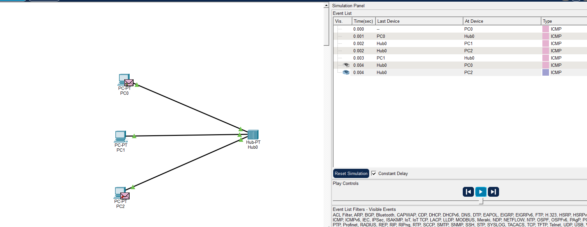

4. Observe whether PC2 receives a copy of the packet.

- **Topology**: PC1, PC2, PC3 connected to a hub
- **Observation**: When PC1 sends an ARP request, PC2 and PC3 also receive it.
- **Conclusion**: Hubs broadcast all traffic to every connected device. This makes network communication visible to unintended recipients, resulting in **low security**.

## Part B. Switch Network

1. Replace the hub with a Switch and reconnect PCs (same IPs).
2. Repeat the Simple PDU test PC0 → PC1 and observe packet visibility at PC2.

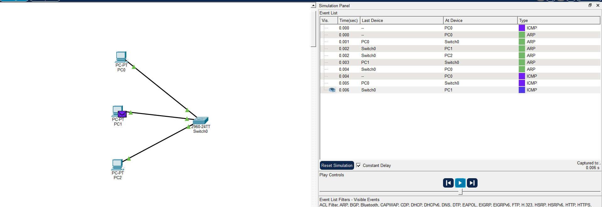

- **Topology**: PC1, PC2, PC3 connected to a switch
- **IP Configuration**:
  - PC1: 192.168.2.1
  - PC2: 192.168.2.2
  - PC3: 192.168.2.3
- **Observation**: When PC1 sends a Simple PDU to PC2, PC3 does not receive a copy.
- **Conclusion**: Switches forward packets only to the intended recipient using MAC address lookup. This results in **high security** and prevents packet sniffing by other devices.

Hub vs Switch Security Comparison

| Setup  | Device | Packet Visibility at PC2 | Security Level |
| ------ | ------ | ------------------------ | -------------- |
| Part A | Hub    | Visible (broadcast)      | Low            |
| Part B | Switch | Not visible (unicast)    | High           |
